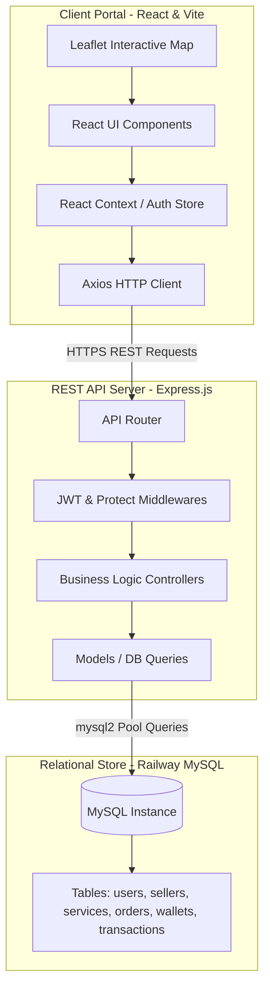

# ⚡ QuickSeva - Local Service Marketplace Platform

<div align="center">

[](https://react.dev/)
[](https://vitejs.dev/)
[](https://tailwindcss.com/)
[](https://nodejs.org/)
[](https://expressjs.com/)
[](https://www.mysql.com/)
[](https://leafletjs.com/)

**Connecting Local Service Providers with Customers through Interactive Geo-location Mapping**

[Description](#-project-description) • [Features](#-key-features) • [Tech Stack](#-tech-stack) • [Architecture](#-system-architecture) • [Directory Structure](#-folder-structure) • [Database Design](#-database-design-overview) • [Installation](#-installation-guide) • [API Documentation](#-api-endpoints-overview)

</div>

---

## 📝 Project Description

**QuickSeva** is a modern, full-stack, hyper-local service marketplace platform that bridges the gap between customers (buyers) and nearby independent professionals (sellers/service providers). Built with a robust **React-Node-MySQL** architecture, it allows users to discover services in real-time, view verified providers on an interactive leaflet-based map, consult reviews, book services, manage transactions using a built-in wallet, and switch dynamically between buyer and seller profiles.

Whether a user needs an emergency plumber, a professional home cleaner, an electrician, or an AC technician, **QuickSeva** makes finding help immediate, location-aware, and highly secure.

---

## ✨ Key Features

### 👤 User & Auth Flow
*   **OTP-Based Secure Authentication:** Passwordless signup and login using phone number/email verified via secure One-Time Passwords (OTP).
*   **Dual-Role Account Switching:** Seamless toggle between Customer and Seller mode within a single account dashboard.
*   **Profile Management:** Set detailed locations (lat/lng via map picker), avatar uploads, and operational details.

### 🗺️ Location & Discovery
*   **Interactive Leaflet Maps:** Visualize all nearby service providers as clusters and markers with direct details in custom popups.
*   **Dynamic Geolocation:** Automatic coordinates detection with custom working-radius search (e.g., 5km, 10km, 20km) to find the closest providers.
*   **Category-Based Filters:** Browse through standard domestic categories like Cleaning, Electrical, Plumbing, Carpentry, AC Repair, Pest Control, Home Painting, and Appliance Repair.

### 💼 Seller Suite
*   **Dedicated Seller Dashboard:** View incoming bookings, manage active orders, trace earnings, and review ratings.
*   **Service & Package Builder:** Create, edit, and deactivate custom service packages with custom fixed or hourly prices.
*   **Business Profile & GST:** Add bios, upload verification documents, and configure GST information.

### 💳 Transaction & Wallet System
*   **Secure Wallet System:** Virtual wallet for prompt booking, handling platform fees, crediting earnings, and managing topups.
*   **Transaction Logs:** Detailed transaction ledger tracking every credit/debit event associated with orders, refunds, and top-ups.

### 📦 Order & Review Pipeline
*   **Life-cycle Order Tracker:** Real-time state transitions for bookings: `Pending` ➔ `Accepted` ➔ `In Progress` ➔ `Completed` / `Cancelled`.
*   **Ratings & Review System:** Leave ratings (1-5 stars) and comments on completed orders to establish provider trustworthiness.

---

## 🛠️ Tech Stack

### Frontend
*   **React.js (v19):** Component-based interactive user interface.
*   **Vite:** Superfast bundle tool for development and builds.
*   **Tailwind CSS:** Modern utility-first styling library.
*   **React Router Dom (v6):** Client-side navigation & layout routing.
*   **Axios:** Promise-based HTTP client for API communication.
*   **Leaflet & React-Leaflet:** Interactive map rendering and geolocation plotting.
*   **Framer Motion:** High-performance, smooth animations for pages and modals.

### Backend
*   **Node.js & Express.js:** Fast, unopinionated REST API server architecture.
*   **JWT (JSON Web Tokens):** Secure, stateless request authentication.
*   **OTP Verification Engine:** Time-based custom OTP generator with expiration checks.
*   **Multer:** Middleware for handling `multipart/form-data` file and avatar uploads.
*   **Nodemailer:** Automated notification emails and OTP deliveries.

### Database
*   **MySQL:** Structured relational storage for users, transactions, and bookings.
*   **mysql2 Connection Pool:** Promise-enabled pool management for low latency and high concurrency.

### Deployment & Infrastructure
*   **Frontend:** Hosted on **Vercel** with custom redirects.
*   **Backend:** Deployed on **Render** (monitored via health checks).
*   **Database:** Hosted on **Railway MySQL** with remote connection configuration.

---

## 📐 System Architecture

QuickSeva utilizes a classic **Client-Server-Database** architectural pattern, optimized for low latency geolocation calculations:



---

## 📂 Folder Structure

Below is the directory tree of the QuickSeva project, reflecting its clean separation of concerns:

```
QuickSeva/
├── backend/                        # Express API Server
│   ├── config/                     # Database connection pool setup (db.js)
│   ├── controllers/                # Logic handlers (auth, user, seller, order, wallet, etc.)
│   ├── middleware/                 # Auth verification, error handlers, and file upload configs
│   ├── migrations/                 # Incremental SQL migration scripts
│   ├── models/                     # Raw SQL abstraction layers (Service, UserModel, Order, etc.)
│   ├── routes/                     # API route declarations
│   ├── services/                   # Utility integrations (e.g., Mail service)
│   ├── uploads/                    # Local storage for avatars and document attachments
│   ├── utils/                      # Helper modules (OTP generation, geolocation helpers)
│   ├── database.sql                # Base database schema definition
│   ├── initialize_db.js            # Automated database setup and seeder script
│   ├── package.json                # Backend dependency definitions
│   └── server.js                   # Application entry point
│
├── frontend/                       # React Frontend Application
│   ├── public/                     # Static assets (icons, maps, logos)
│   ├── src/
│   │   ├── api/                    # Custom Axios interceptors & HTTP configuration
│   │   ├── assets/                 # SVGs and global styling images
│   │   ├── components/             # Reusable UI widgets (LocationPicker, NearbyServices, etc.)
│   │   ├── config/                 # Environment variables and API URL settings
│   │   ├── context/                # React Context providers (AuthContext)
│   │   ├── layouts/                # Shared page shells (Navbar, Footer wraps)
│   │   ├── pages/                  # Page-level components
│   │   │   ├── seller/             # Seller dashboard, packages, and wallet pages
│   │   │   └── ...                 # Auth, Home, Profile, Booking pages
│   │   ├── App.jsx                 # Route declarations & main application setup
│   │   ├── index.css               # Tailwind styling declarations
│   │   └── main.jsx                # DOM mounting entrypoint
│   ├── tailwind.config.js          # Tailwind styling rules and variables
│   ├── vite.config.js              # Vite compiler and proxy settings
│   └── package.json                # Frontend package configuration
```

---

## 🗄️ Database Design Overview

The database design contains 12 primary tables with performance indexes. Relational integrity is enforced using foreign keys and cascading rules.

### Entity-Relationship Diagram Summary

```
   +-------------------+          +-------------------+          +-------------------+
   |       users       | 1      * |      sellers      | 1      * |     services      |
   | (id, phone, role) +----------+ (id, user_id, bio)+----------+ (id, seller_id)   |
   +---------+---------+          +---------+---------+          +---------+---------+
             | 1                            | 1                            | 1
             |                              |                              |
             | 1                            | 1                            | *
   +---------v---------+          +---------v---------+          +---------v---------+
   |      wallets      | 1      * |      orders       | *      1 |      reviews      |
   | (id, user_id, bal)+----------+ (id, buyer/seller)+----------+ (id, order_id)    |
   +-------------------+          +-------------------+          +-------------------+
```

### Table Definitions

| Table Name | Description | Key Columns |
| :--- | :--- | :--- |
| `users` | All registered buyers, sellers, and admins. | `id` (PK), `phone` (Unique), `email`, `role`, `lat`, `lng`, `is_verified` |
| `sellers` | Extended details of users acting as service providers. | `id` (PK), `user_id` (FK ➔ users), `category_id`, `working_radius`, `gst_number` |
| `categories` | Available service domains (Plumbing, Cleaning, etc.). | `id` (PK), `name`, `icon` |
| `sub_services` | Standardized catalog tasks grouped under categories. | `id` (PK), `category_id` (FK ➔ categories), `name`, `default_price` |
| `seller_categories` | Many-to-many lookup connecting sellers to categories. | `seller_id` (FK ➔ sellers), `category_id` (FK ➔ categories) (Composite PK) |
| `services` | Specific offerings created by sellers with pricing. | `id` (PK), `seller_id` (FK ➔ sellers), `price`, `price_type`, `is_instant` |
| `orders` | Bookings containing total costs, status, and locations. | `id` (PK), `buyer_id` (FK ➔ users), `seller_id` (FK ➔ sellers), `status` |
| `wallets` | Balance records matching users. | `id` (PK), `user_id` (FK ➔ users), `balance` |
| `wallet_transactions` | Audit ledger for wallet balance changes. | `id` (PK), `wallet_id` (FK ➔ wallets), `type`, `amount`, `source` |
| `reviews` | Feedback given by buyers to sellers for orders. | `id` (PK), `order_id` (FK ➔ orders), `buyer_id`, `rating`, `comment` |
| `notifications` | System notifications and order status alerts. | `id` (PK), `user_id` (FK ➔ users), `title`, `message`, `is_read` |
| `otp_verifications` | Temp verification codes for authentication. | `id` (PK), `identifier`, `otp`, `expires_at`, `is_used` |

---

## ⚙️ Installation Guide

Follow these steps to set up QuickSeva on your local machine:

### Prerequisites
*   [Node.js](https://nodejs.org/en) (v18.x or above)
*   [MySQL Server](https://dev.mysql.com/downloads/installer/) (v8.0 or above)
*   Git

### 1. Clone the Repository
```bash
git clone https://github.com/your-username/QuickSeva.git
cd QuickSeva
```

### 2. Database Initialization
1.  Open your MySQL terminal or client (e.g. phpMyAdmin, DBeaver) and create a database:
    ```sql
    CREATE DATABASE quickseva_db;
    ```
2.  Import the schema:
    ```bash
    mysql -u root -p quickseva_db < backend/database.sql
    ```

---

## 🔒 Environment Variables

You need to create configuration files in both `backend` and `frontend` directories before running the servers.

### Backend Configurations
Create a `.env` or `.env.local` inside the `backend/` directory:

```env
# Server Configuration
PORT=5000
NODE_ENV=development

# Database Setup (Local)
DB_HOST=localhost
DB_PORT=3306
DB_USER=root
DB_PASSWORD=your_mysql_root_password
DB_NAME=quickseva_db

# Security & Authentication
JWT_SECRET=your_jwt_signing_key_secret_change_me
JWT_EXPIRES_IN=7d

# Mailing Credentials (OTP Verification)
EMAIL_HOST=smtp.gmail.com
EMAIL_PORT=587
EMAIL_USER=your_email@gmail.com
EMAIL_PASS=your_gmail_app_password

# File Management
MAX_FILE_SIZE=5242880
UPLOAD_PATH=./uploads

# CORS Origin Whitelist
FRONTEND_URL=http://localhost:5173
```

### Frontend Configurations
Create a `.env` inside the `frontend/` directory:

```env
# API Server Entry Point
VITE_API_URL=http://localhost:5000/api
```

---

## 🚀 Running Locally

Follow these terminal commands to bring up the local development servers:

### Step 1: Set up the Backend
```bash
cd backend
npm install

# Run database setup & seed 100 sample providers inside Ahmedabad
node initialize_db.js

# Start backend server in development mode (with nodemon)
npm run dev
```

### Step 2: Set up the Frontend
Open a new terminal window:
```bash
cd frontend
npm install

# Start Vite hot-reloading development server
npm run dev
```
The React frontend should now be running on [http://localhost:5173](http://localhost:5173).

---

## 🔌 API Endpoints Overview

The backend exposes the following REST API endpoints:

### Authentication & Profiles
*   `POST /api/auth/send-otp` - Initiates OTP login/registration.
*   `POST /api/auth/verify-otp` - Validates OTP token, returns JWT payload.
*   `POST /api/auth/login` - Legacy credentials authorization (Admin).
*   `GET /api/auth/me` - Recovers logged-in user context *(Protected)*.
*   `PUT /api/users/profile` - Edits user personal profile *(Protected)*.

### Geolocation & Service Search
*   `GET /api/nearby/sellers?lat=..&lng=..&radius=..` - Returns providers inside radial boundaries.
*   `GET /api/nearby/categories` - Returns active categories listing.
*   `GET /api/nearby/category/:category_id` - Returns nearby providers filtered by skill category.
*   `GET /api/search?q=...` - Full-text search on services/sellers.

### Services Management
*   `POST /api/services` - Creates a new service offering *(Protected/Seller)*.
*   `GET /api/services/seller` - Fetches seller's own listings *(Protected/Seller)*.
*   `PUT /api/services/:id` - Modifies service packages *(Protected/Seller)*.
*   `DELETE /api/services/:id` - Deletes a service package *(Protected/Seller)*.

### Order Pipeline
*   `POST /api/orders` - Places a new booking *(Protected/Buyer)*.
*   `GET /api/orders/my` - Fetches customer booking history *(Protected/Buyer)*.
*   `GET /api/orders/seller` - Fetches active seller assignments *(Protected/Seller)*.
*   `PATCH /api/orders/:id/accept` - Changes booking status to Accepted *(Protected/Seller)*.
*   `PATCH /api/orders/:id/start` - Changes booking status to In Progress *(Protected/Seller)*.
*   `PATCH /api/orders/:id/complete` - Completes order, transfers funds *(Protected/Seller)*.
*   `PATCH /api/orders/:id/cancel` - Rejects/cancels booking, triggers refund *(Protected)*.

### Wallet Control
*   `GET /api/wallet` - Retrieves wallet balance *(Protected/Seller)*.
*   `GET /api/wallet/transactions` - Returns all wallet transaction rows *(Protected/Seller)*.
*   `POST /api/wallet/topup` - Adds fake credits to wallet *(Protected/Seller)*.

---

## 🌐 Deployment Instructions

### 1. Frontend (Vercel)
1.  Push the code to your GitHub Repository.
2.  Import the repository to your Vercel Dashboard.
3.  Set the **Root Directory** as `frontend`.
4.  Add the environment variable `VITE_API_URL` pointing to your hosted Express server (e.g. `https://quickseva-backend.onrender.com/api`).
5.  Deploy. (Vercel automatically picks up the build commands `npm run build` and `dist` output folder).

### 2. Backend (Render)
1.  Create a Web Service on Render.
2.  Link your GitHub Repository.
3.  Set the **Root Directory** as `backend`.
4.  Define **Build Command** as `npm install` and **Start Command** as `npm start`.
5.  Set your Environment Variables in the Render Settings console (using the variables from your local `.env`).
6.  Enable automatic health checks targeting the `/api/health` endpoint to prevent the cold-start delay.

### 3. Database (Railway MySQL)
1.  Log in to Railway and spin up a new MySQL Database service.
2.  Railway will generate host, port, user, password, and database details.
3.  Connect to Railway MySQL database using a GUI client, run `database.sql`, and then run the migrations.
4.  Configure your Render backend `.env` variables (`DB_HOST`, `DB_USER`, etc.) to point to Railway's credentials.

---

## 🔮 Future Improvements

Here are the features planned for future updates:
*   💬 **In-App Live Chat:** Direct real-time messaging between buyer and seller using WebSockets (`socket.io`).
*   💳 **Real Payment Gateway integration:** Integration of Razorpay/Stripe API for actual fund top-ups.
*   🚨 **Push Notifications:** Web-push alerts (FCM) to notify users when a provider accepts an order.
*   📈 **Seller Analytics Panel:** Earnings graph, conversion rates, and monthly revenue trackers for providers.
*   🚗 **Real-time Map Tracking:** Live GPS tracking showing the seller's moving coordinate on the buyer's map.

---

## 📸 Screenshots

> *Add application screenshots showcasing the interactive map, seller dashboard, and transaction history below.*

| Search Page & Map | Seller Dashboard | User Profile & Wallet |
| :---: | :---: | :---: |
|  |  |  |

---

## 👥 Author Information

*   **Your Name / Developer Portfolio**
*   🎓 Final Year BCA/MCA Portfolio Project
*   📧 Email: [your.email@domain.com](mailto:your.email@domain.com)
*   🔗 LinkedIn: [linkedin.com/in/yourprofile](https://linkedin.com/in/yourprofile)
*   🐙 GitHub: [github.com/your-username](https://github.com/your-username)

---
<div align="center">
Made with ❤️ for QuickSeva. If you like this project, please star this repository! ⭐
</div>
